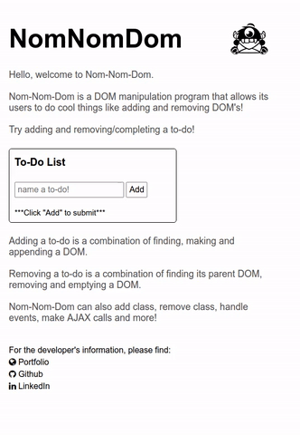

## NomNomDom

[DEMO](http://sangwlee.com/Nom-Nom-Dom/)
<div>

</div>
<br />

NomNomDom allows user to to make AJAX requests, handle events, manipulate DOM, and guarantee it works across browsers.

### Notable Functions

  1. [DOM Manipulation and Traversal](#dom-manipulation-and-traversal)
  2. [Event Handling](#event-handling)
  3. [AJAX](#ajax)

### DOM Manipulation and Traversal

Allows user to manipulate the DOM using empty, remove, attr, addClass, removeClass, html, find, children and parent.

```javascript
    function $l(arg) {
      if (arg instanceof Function) {
        if (document.readyState == 'complete') arg();
        else docReadyCallbacks.push(arg);
        return;
      }

      let arrayEl;
      if (arg instanceof HTMLElement) {
        arrayEl = [arg];
      } else {
        const nodeList = document.querySelectorAll(arg);
        arrayEl = Array.from(nodeList);
      }
      console.log(arrayEl);
      return new DOMNodeCollection(arrayEl);
    }
```

* $l(selector) : Allows identification of nodes in the page.
* html : Receives a string as parameter, depending on input can manipulate innerHTML differently.
* empty : Clears out the content of all nodes.
* append : Appends the outerHTML of each elements in the argument.
* addClass / removeClass : Adds or removes class to the DOM.
* children : Returns DOMNodeCollection of all children.
* parent : Returns DOMNodeCollection of the parents.
* find : Returns DOMNodeCollection of all the nodes matching the selector.
* remove: Removes the html of all the nodes in the array.

### Event Handling

Allows specified events to trigger desired effects.

```javascript
    on(action, callback) {
      this.each(el => el.addEventListener(action, callback));
      this.callback = callback;
    }
```

* on : Adds event listener to the DOM.
* off : Removes event listenter from the DOM.

### AJAX

Can send AJAX requests.

```javascript
    Function.prototype.ajax = function(options) {
      const defaults = {
        method: "GET",
        url: window.location.href,
        dataType: "json",
        data: {},
        success: (data) => console.log(data),
        error: (err) => console.log(err)
      };

      const opts = this.extend(defaults, options);

      const xhr = new XMLHttpRequest();
      xhr.open(opts.method, opts.url);
      xhr.onload = (xhr.status < 400) ? opts.success(xhr.response) : opts.error(xhr.response);
      xhr.responseType = opts.dataType;
      xhr.send(opts.data);
    };
```
